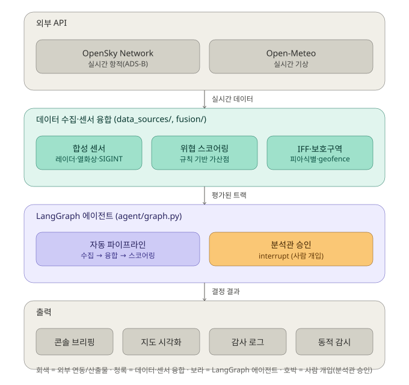
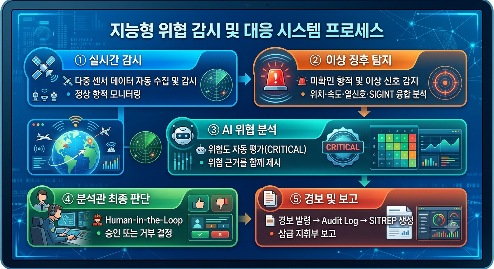

# 다중 센서 위협 융합 브리핑 에이전트 (국방 시뮬레이션)

## 기술 아키텍처



## 운영 시나리오



4단계로 압축한 스토리보드: 평시 감시 → 위협 평가 및 분석관 승인 대기(interrupt) → 승인/경보 발령 → SITREP 생성 및 상급 보고. 전체 8단계 버전과 이미지 생성 프롬프트는 `운영_시나리오_스토리보드.md` 참고.

## 구조

```
defense_sim_agent/
├── data_sources/
│   ├── flight_tracker.py     # 실제 API: OpenSky Network (실시간 항공기 위치)
│   ├── weather_api.py        # 실제 API: Open-Meteo (실시간 기상)
│   └── synthetic_sensors.py  # 합성: 레이더/열화상/SIGINT (실제 트랙에 상관시켜 생성)
├── fusion/
│   └── threat_scoring.py     # 규칙 기반 다중 센서 융합 위협 스코어링
├── agent/
│   └── graph.py               # LangGraph 파이프라인 (수집→융합→평가→[분석관 확인]→브리핑)
├── main.py                    # 실행 진입점 (대화형, 분석관 승인 입력 받음)
└── test_interrupt_flow.py     # 분석관 확인(interrupt) 흐름 자동 테스트 (목데이터)
```

## 분석관 확인(Human-in-the-loop) 구조

위협 점수가 55점(HIGH) 이상인 트랙이 하나라도 있으면, 파이프라인은 `analyst_review`
노드에서 **자동으로 멈추고** 사람의 승인을 기다립니다. LangGraph의 `interrupt()` +
`MemorySaver`(checkpointer) 조합으로 구현했습니다.

```
fetch_data → fuse_sensors → assess_threats ─┬─(HIGH 이상 없음)→ generate_brief
                                             └─(HIGH 이상 있음)→ analyst_review ⏸
                                                                    │
                                                        승인(approve) │ 거부(reject)
                                                                    ▼         ▼
                                                              send_alert  generate_brief
                                                                    │
                                                                    ▼
                                                              generate_brief → END
```

- `thread_id`로 세션을 구분하므로, 여러 감시 구역/사용자를 동시에 운용 가능
- 실전에서는 `input()` 대신 웹 UI의 "승인/거부" 버튼이 `Command(resume=...)`를 호출하면 됨
- `test_interrupt_flow.py`로 실제 API 없이도 이 흐름만 독립적으로 검증 가능

## 실행 방법 (본인 PC, 인터넷 연결 환경)

```bash
pip install -r requirements.txt
export ANTHROPIC_API_KEY=sk-ant-...   # 없어도 동작(원시 데이터로 폴백)
python main.py
```

## 설계 포인트 (포트폴리오 설명용)

1. **실제 데이터 + 합성 데이터 하이브리드**: 실제 군사 센서 데이터는 공개되지 않으므로,
   공개 ADS-B 항적을 '실제 물체'로 삼고 레이더/열화상/SIGINT는 그 물체의 물리량(고도·속도)에
   상관된 합성 신호로 생성. 완전 무작위보다 훨씬 설득력 있는 데모가 됩니다.

2. **장애 허용 설계(Fail-safe)**: 각 API 호출 모듈은 실패 시 예외를 던지지 않고
   빈 값/기본값으로 폴백합니다. 실시간 데이터 파이프라인에서 흔한 요구사항입니다.

3. **설명 가능한 스코어링**: 위협 점수는 블랙박스가 아니라 `reasons` 리스트로
   근거를 남겨서, LLM 브리핑 생성 단계와 사람의 최종 판단(Human-in-the-loop) 모두에
   활용 가능합니다.

## 확장 아이디어

- 위협 스코어링을 규칙 기반 -> 라벨링된 시나리오로 학습한 모델로 교체
- FastAPI로 감싸서 실시간 대시보드(React/Chart.js)에 연결
- LangGraph에 사람 승인 노드(interrupt) 추가 -> 자동 경보 대신 분석관 확인 후 발령
