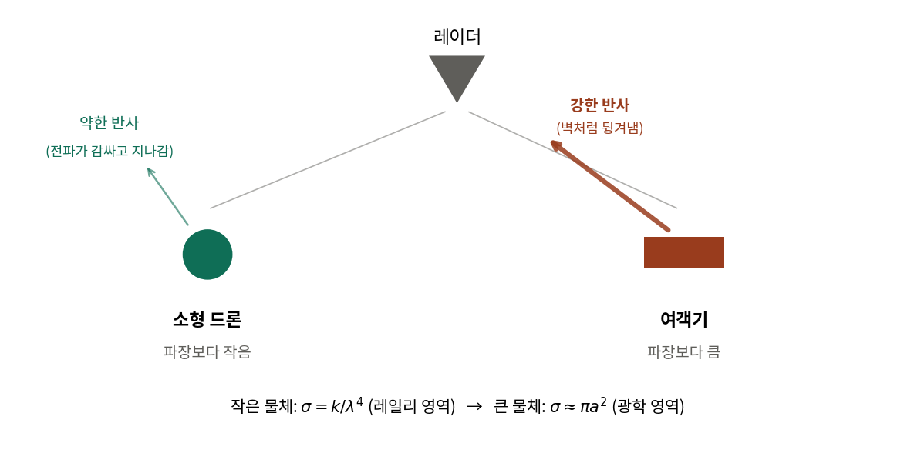
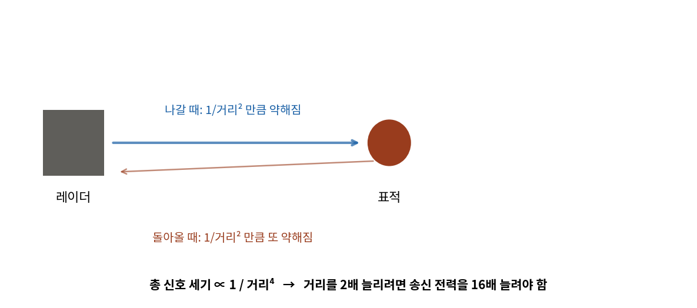
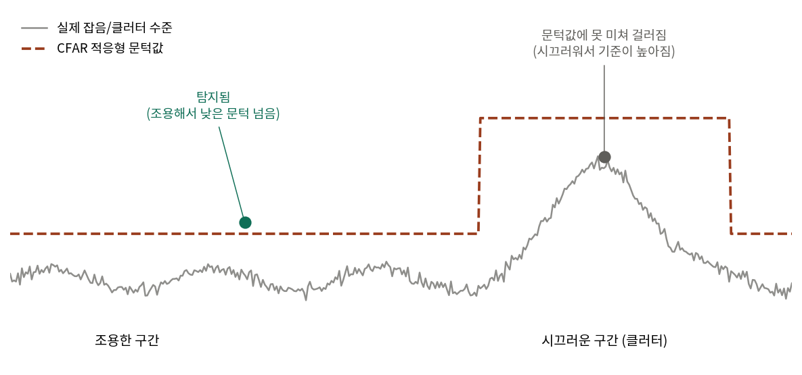
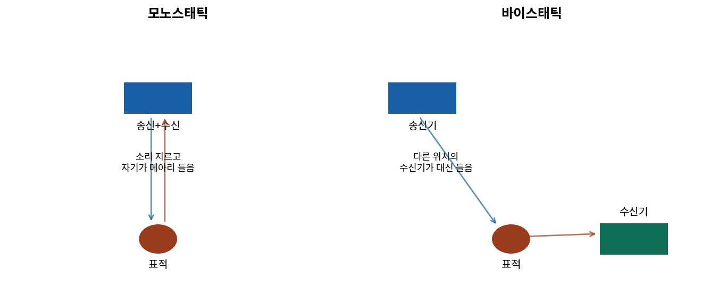

# 레이더 기초 개념 정리

> `개발_기초_개념_정리.md`가 소프트웨어/에이전트 개발 개념을 다룬다면, 이 문서는
> 방산 도메인(레이더 물리학) 개념을 같은 방식(비유·그림 먼저, 그다음 압축 인용)으로 정리한다.
> `논문_리뷰_노트.md`는 "이미 이해한 걸 압축해서 인용하는 용도"라 처음 배울 땐 이 문서를 먼저 볼 것.
> 2026-08-12 작성.

---

## 미리 알아둘 약어

| 약어 | 풀네임 | 뜻 |
|---|---|---|
| **RCS** | Radar Cross Section | 레이더 반사단면적 — 물체가 전파를 얼마나 강하게 반사하는지(㎡) |
| **Pd** | Probability of Detection | 탐지확률 — 진짜 표적이 있을 때 맞게 탐지할 확률 |
| **Pfa** | Probability of False Alarm | 오경보확률 — 표적이 없는데 잡음을 표적으로 잘못 판단할 확률 |
| **CFAR** | Constant False-Alarm Rate | 정오경보율 유지 — Pfa를 항상 일정하게 유지하도록 탐지 문턱값을 조정하는 기법 |
| **SNR** | Signal-to-Noise Ratio | 신호대잡음비 — 신호가 잡음보다 얼마나 센지(dB) |

**Pd/Pfa의 관계 (개념 수준)**:
```
Pfa = Q( 문턱값 / 잡음수준 )              ← 잡음만 있는데 문턱값을 넘을 확률
Pd  = Q( (문턱값 - 신호세기) / 잡음수준 )   ← 신호+잡음이 문턱값을 넘을 확률
```
`Q()`는 "그 값보다 클 확률"을 계산하는 함수. 정확한 계산은 Marcum Q함수(복잡한 닫힌 형태)를 쓰는데, 실무에서는 이를 근사한 **Albersheim 공식** 같은 경험식을 쓴다 (`논문_리뷰_노트.md`의 KIMST 무인기 논문 항목 참고).

---

## 1. Rayleigh 산란 vs 광학 영역 — "왜 작은 물체는 레이더에 안 잡히나"



**비유**: 잔잔한 호수에 돌을 던지는 상황. 작은 조약돌은 물결이 갈라지듯 지나가면서 파동이 거의 안 튀지만, 큰 바위는 물결을 정면으로 튕겨냅니다. 레이더 전파도 똑같습니다 — 물체가 전파 파장보다 작으면(드론) 전파가 "감싸고 지나가면서" 아주 약하게만 되돌아오고, 파장보다 크면(여객기) "벽처럼" 강하게 튕겨냅니다.

**공식**: 작은 물체는 σ = k/λ⁴ (레일리 영역, 크기의 4제곱에 비례해 RCS가 급격히 작아짐), 큰 물체는 σ ≈ πa² (광학 영역, 물체의 실제 단면적에 가까워짐).

**우리 프로젝트와의 연결**: 소형 무인기가 레이더에 잘 안 잡히는 이유가 바로 이것. `synthetic_sensors.py`의 RCS 임의값 생성 로직에 이 개념을 근거로 인용해둠.

---

## 2. 레이더 방정식 — "손전등의 왕복 여행"



**비유**: 손전등을 벽에 비추고 반사광을 다시 내 눈으로 보는 상황. 손전등에서 벽까지 갈 때 한 번 흐려지고, 벽에서 반사돼 내 눈까지 돌아올 때 또 한 번 흐려집니다. "왕복 여행"이라 약해지는 게 두 번 겹칩니다.

**공식**: 신호 세기 ∝ 1/거리⁴ (거리 제곱씩 두 번). 그래서 탐지거리를 2배로 늘리려면 송신 전력을 16배(2⁴) 늘려야 함 — 레이더 성능 향상이 왜 쉽지 않은지의 근거.

---

## 3. CFAR — "시끄러운 곳에서는 귀를 더 세워야 한다"



**비유**: 조용한 도서관에서는 작은 속삭임도 들리지만, 시끄러운 공사장에서는 크게 외쳐야 들립니다. CFAR는 레이더가 이걸 자동으로 계산하는 것 — 주변 잡음 수준을 계속 측정하면서 "이 정도는 넘어야 진짜 표적이다"라는 문턱값을 실시간으로 올리고 내립니다.

**우리 프로젝트와의 연결**: 문헌 근거 없이 직접 설계했던 "지속성 게이트"(단일 관측만으로는 CRITICAL 확정 안 함, 반복 관측 시에만 격상)가 CFAR와 발상이 유사하다는 걸 Skolnik 교과서를 읽다가 사후적으로 발견함 (`LangGraph_위협융합_에이전트_진행기록.md` 14번 섹션 참고). 우리가 만든 규칙이 기존 레이더 공학 이론과 맞닿아 있었다는 뜻.

---

## 4. 바이스태틱 레이더 — "소리 지르는 사람과 듣는 사람이 다르다"



**비유**: 모노스태틱은 "내가 소리 지르고 내가 메아리를 듣는" 것이고, 바이스태틱은 "내가 소리 지르면 다른 곳의 친구가 메아리를 대신 들어주는" 구조. 친구가 다른 각도에서 듣기 때문에, 내가 못 듣는 소리(스텔스기처럼 특정 방향으로는 반사가 약한 물체)를 친구는 들을 수도 있음.

**우리 프로젝트와의 연결**: OpenSky(항공기 트랜스폰더가 신호를 보내고 지상국이 수신)도 개념적으로 송신원·수신원이 분리된 바이스태틱 구조와 유사.

---

## 이 정도면 이해했다고 할 수 있나 — 두 가지로 나눠서 판단

### "왜 이렇게 설계했는지 설명할 수 있는 수준" — 충분함
위 4개 개념만으로 "왜 RCS를 랜덤값으로 넣었나", "왜 지속성 게이트를 만들었나", "왜 OpenSky를 군사 레이더처럼 다뤘나"에 막힘없이 답할 수 있음. 면접에서 나올 법한 질문 대응으로는 이 수준으로 충분.

### "논문의 수식을 직접 계산할 수 있는 수준" — 아직 부족, 그리고 이 프로젝트 스코프에선 필요 없음
"SNR 15dB에서 Swerling I 표적의 Pd를 계산해보라"는 질문에는 못 답함. 다만 우리 프로젝트 자체가 `random.uniform()`으로 흉내만 내는 수준이라, "개념과 근거는 인용할 수 있지만 실제 계산 구현까지는 스코프 밖"이라고 정직하게 답하는 게 적절함.

### 논문을 직접 다 읽어야 하나 — 아니요

| 자료 | 읽는 방식 |
|---|---|
| KIMST 무인기 논문 2절(수식) | 한 번 훑어보기 추천 — 개념과 수식을 잇는 다리 |
| Skolnik 2장 | 시간 되면 훑어보기 |
| Swerling(1960), Marcum(1947) 원논문 | 직접 읽지 않아도 됨 — 난이도 높은 1차 수학 논문, 인용 근거로만 사용 |
| MIT RCS 강의자료 | 이미 충분히 봄 |
